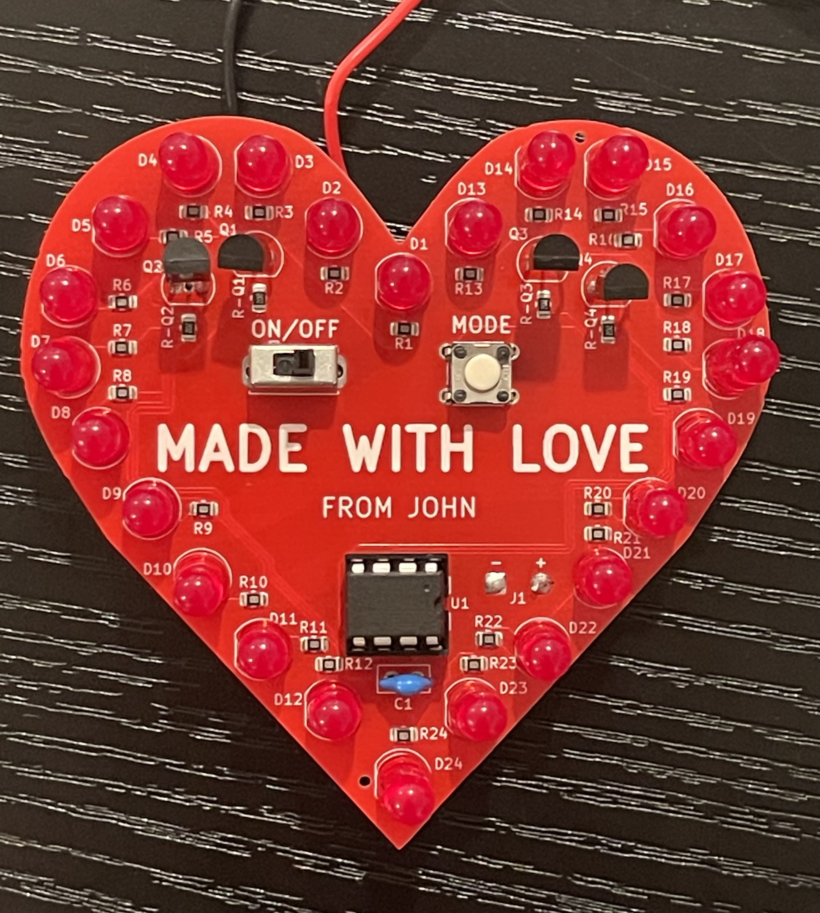
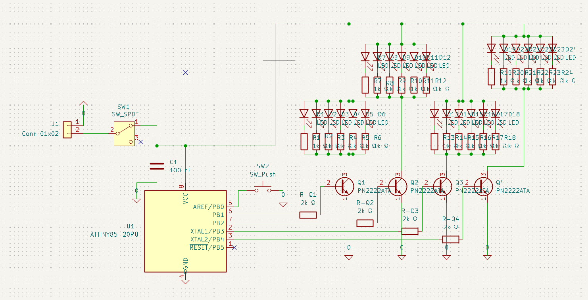
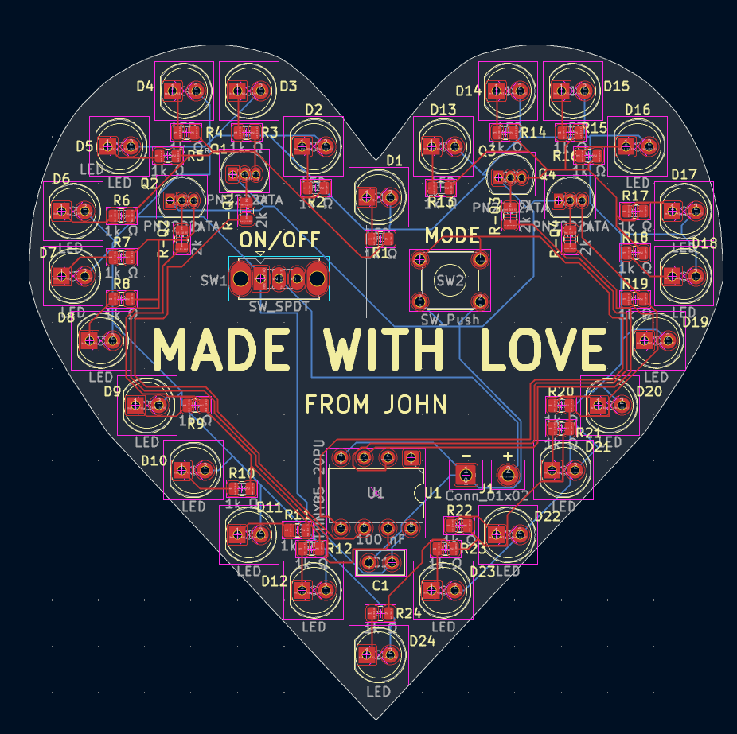
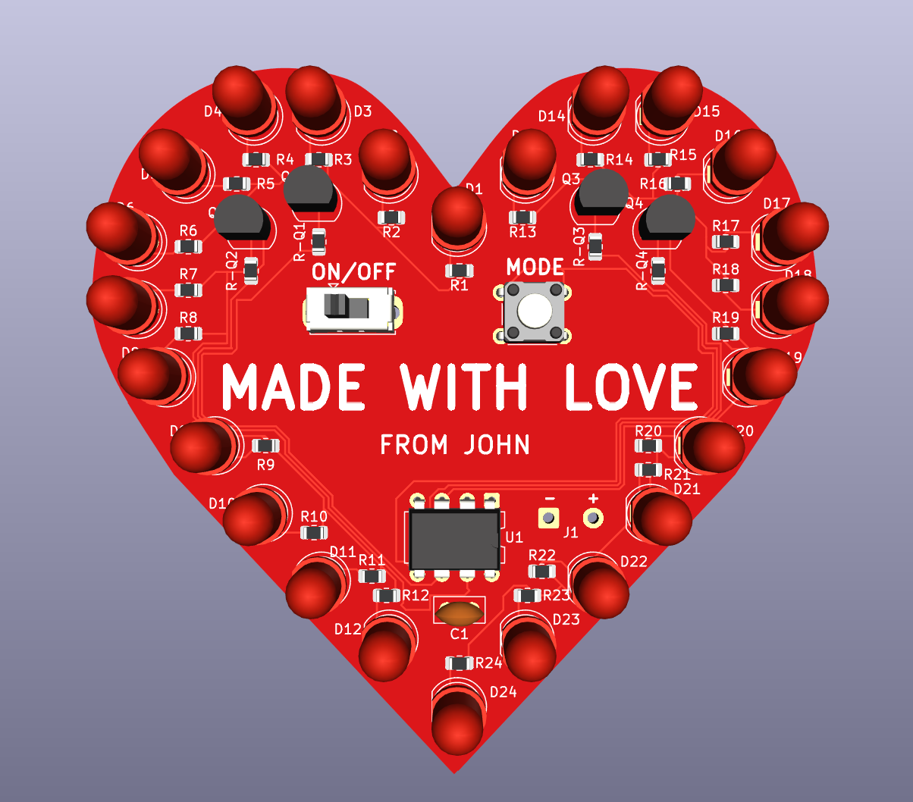
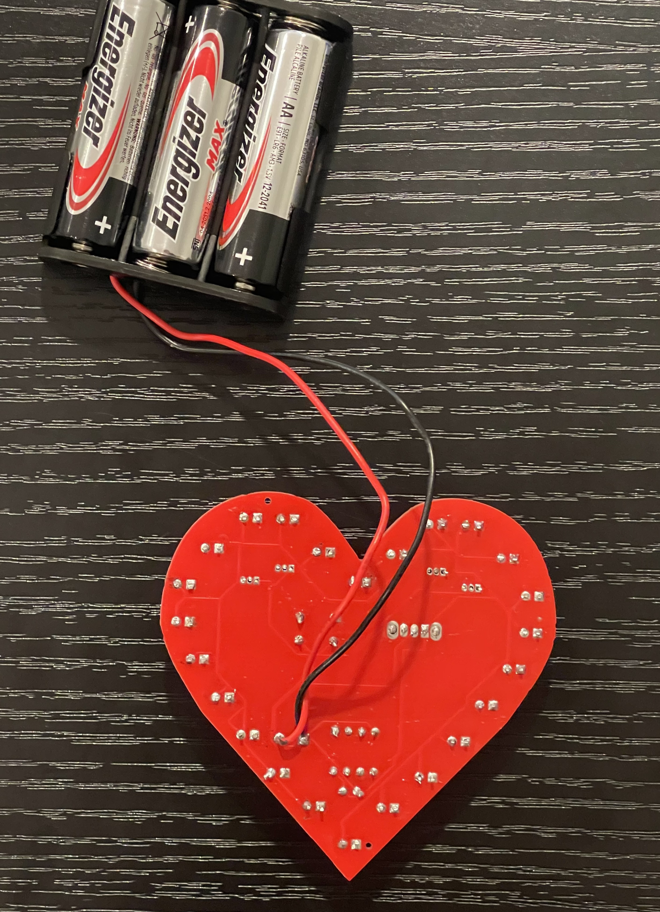

# ATtiny85 Heart PCB

A custom heart-shaped PCB built around an ATtiny85 microcontroller with 24 red LEDs, four transistor-switched lighting groups, a pushbutton for changing animation modes, and non-blocking embedded firmware.



## Demo

[Watch the LED animation demo on YouTube](https://youtube.com/shorts/_cduVnqTBQo)

The MODE button cycles through five lighting patterns:

1. All LEDs continuously on
2. Slow heartbeat — 500 ms on / 500 ms off
3. Fast heartbeat — 250 ms on / 250 ms off
4. Circular group sequence — Q1 → Q2 → Q4 → Q3
5. Alternating opposite groups — Q1 + Q4 ↔ Q2 + Q3

## Hardware

- ATtiny85 microcontroller
- 24 × 5 mm red LEDs
- 24 × 1 kΩ LED current-limiting resistors
- 4 × PN2222A NPN transistors
- 4 × 2 kΩ transistor base resistors
- MODE pushbutton
- ON/OFF slide switch
- 100 nF decoupling capacitor
- 3 × AA battery supply
- Custom 2-layer heart-shaped PCB

The 24 LEDs are split into four groups. Each group is switched by an NPN transistor controlled by one ATtiny85 GPIO pin.

## Schematic



PB0 is connected to the MODE button using the ATtiny85's internal pull-up resistor. PB1–PB4 control the four transistor-switched LED groups.

## PCB Design

The board was designed in KiCad as a custom 2-layer heart-shaped PCB with a red solder mask and white silkscreen.





## Firmware

The firmware is written in Arduino C/C++ for the ATtiny85 and is available in `firmware/attiny85_heartpcb_v1.ino`.

The MODE button uses the ATtiny85's PB0 pin-change interrupt. The ISR only sets a flag, while the main loop handles debouncing and mode changes.

All animation timing is non-blocking and uses `millis()` rather than `delay()`. Each animation keeps track of its own state so the board can respond to button presses while an animation is running.

The ATtiny85 is configured to use its internal 1 MHz clock.

## Finished Board

### Front


### Back



## Manufacturing and Assembly

The PCB was fabricated by JLCPCB. The surface-mount resistors were populated through PCBA, while the through-hole LEDs, transistors, ATtiny85 socket, switch, pushbutton, capacitor, and battery wiring were assembled by hand.

The repository also includes the KiCad project files:

- `hardware/heart_pcb_v1.kicad_pro`
- `hardware/heart_pcb_v1.kicad_sch`
- `hardware/heart_pcb_v1.kicad_pcb`

## What I Learned

This project covered the full workflow from circuit design through a working physical board:

- Schematic capture and PCB layout in KiCad
- Component placement and routing
- Transistor switching for grouped LED loads
- PCB fabrication and PCBA workflow
- Through-hole and SMD assembly
- ATtiny85 register configuration and pin-change interrupts
- Software button debouncing
- Non-blocking timing with `millis()`
- State-machine based LED animations
- Hardware debugging and continuity testing

One of the biggest lessons from V1 was designing for assembly and reliability. The through-hole TO-92 transistors were difficult to solder and rework because of the tight lead spacing. A future V2 will likely move more of the design to surface-mount parts, including SMD transistors and LEDs, so most of the board can be assembled directly by the manufacturer.

## Repository Structure

```text
ATtiny85-Heart-PCB/
├── README.md
├── firmware/
│   └── attiny85_heartpcb_v1.ino
├── hardware/
│   ├── heart_pcb_v1.kicad_pro
│   ├── heart_pcb_v1.kicad_sch
│   ├── heart_pcb_v1.kicad_pcb
│   └── heart_pcb_v1.kicad_prl
└── images/
    ├── heart_pcb_front.jpg
    ├── heart_pcb_back.jpg
    ├── pcb_3d.png
    ├── pcb_layout.png
    └── schematic.png
```